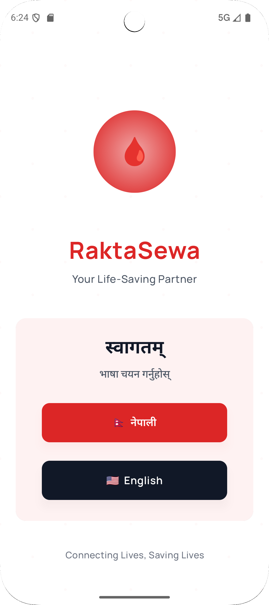
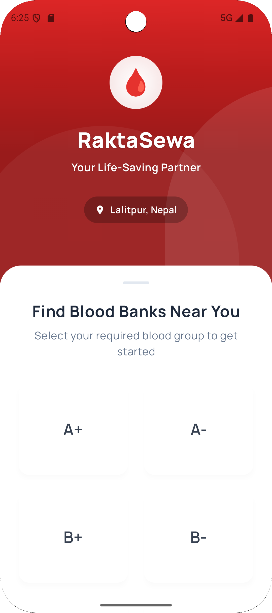
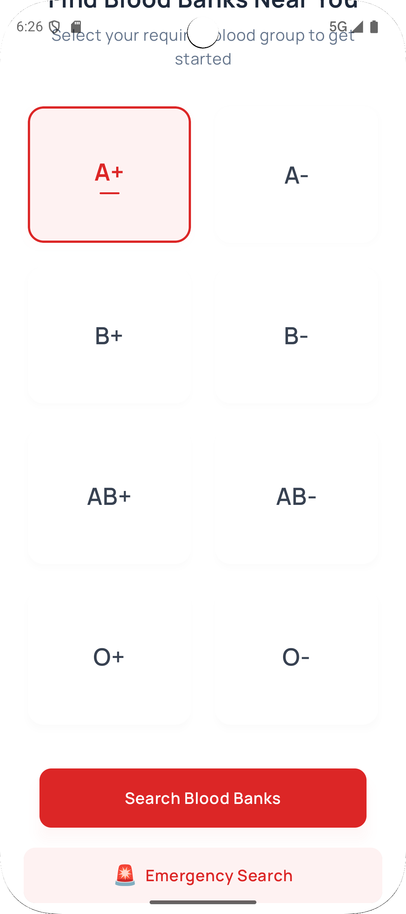
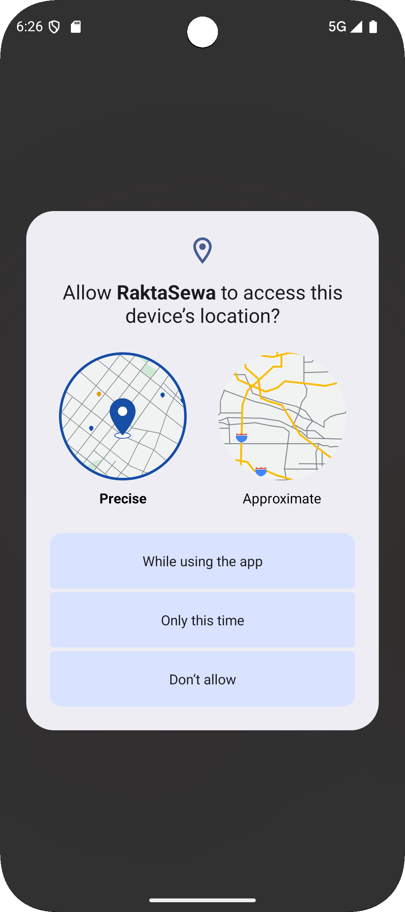
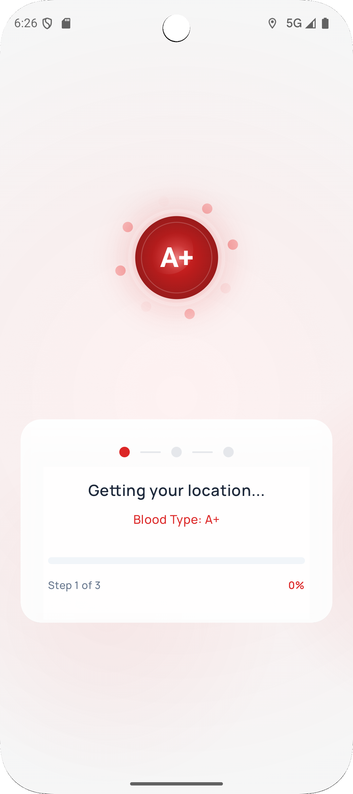
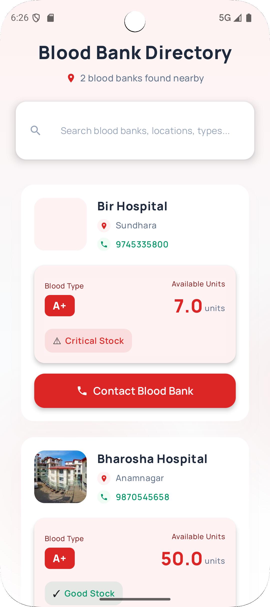
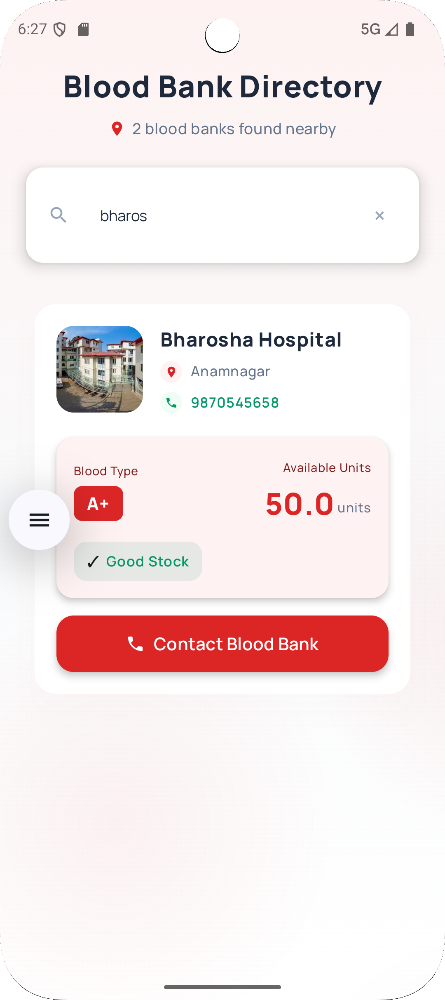
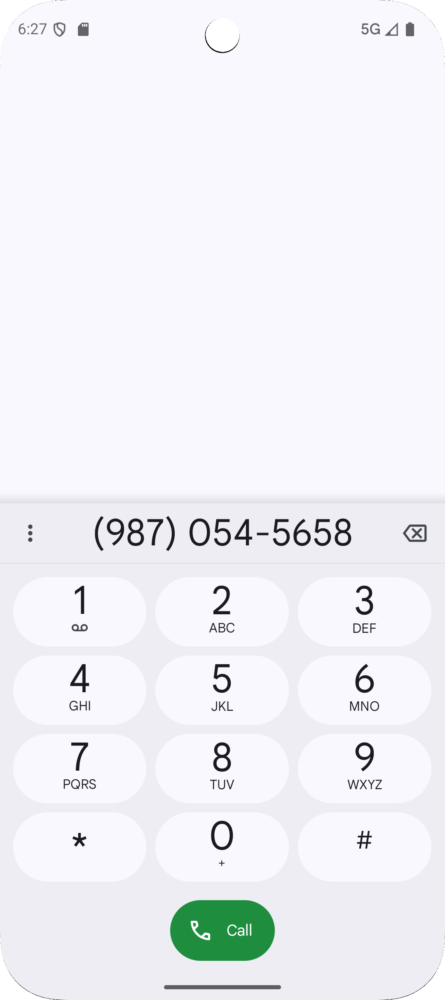

# 🩸 Rakta Sewa — Android Client App

**Rakta Sewa** is the Android client application for a real-time blood bank platform in Nepal.  
The app enables users to quickly locate nearby blood banks and check blood group availability during emergencies.  

> ⚙️ This repository contains **only the Android client**.  
> The **backend (Spring Boot + PostgreSQL)** is maintained separately.

---

## 📸 Screenshots

| Welcome Screen | Select Blood Group | Selected Blood |
|----------------|--------------------|----------------|
|  |  |  |

| Permission | Fetching Data | Blood Banks List |
|-------------|----------------|------------------|
|  |  |  |

| Search Blood Banks | Contact Screen |
|---------------------|----------------|
|  |  |

---

## 🛠️ Features

- Displays real-time **blood bank availability** across Nepal  
- **Search and filter** by blood group or location  
- **Modern UI** built entirely with **Jetpack Compose**  
- Seamless **REST API integration** with a custom Spring Boot backend  
- **Lightweight and fast**, designed for emergency use cases  

---

## 💻 Technology Stack

| Component | Technology |
|------------|-------------|
| **Language** | Kotlin |
| **UI Framework** | Jetpack Compose |
| **Architecture** | MVVM + Repository Pattern |
| **Backend** | RESTful API (Spring Boot) |
| **Database** | PostgreSQL (via backend) |
| **APIs** | Google Maps & Location Services |

---

## 🚀 Getting Started

1. **Clone the repository**
   ```bash
   git clone https://github.com/raktakosh-nepal/RaktaSewa-AndroidApp.git
   cd RaktaSewa-AndroidApp

   
## 👨‍💻 Developers & Contributors

**Lead Developer** 
<br><br>
**PRERIT GAUTAM**
  - Founder and Lead Developer of Rakta Sewa  
  - Developed the entire Android client using **Jetpack Compose** and **Kotlin**  
  - Designed UI/UX, integrated REST APIs, and handled client-side logic  
  - Coordinated with backend developers for API integration and testing


